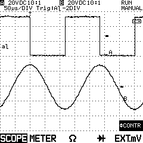

# ScopeMeter99 #

Some utilities to read data from the Fluke ScopeMeter 99 Series II.

## Identification Strings ##

My ScopeMeter 99 II responds to the `ID` command with the following string:

`ScopeMeter 99 Series II; V6.35; 95-02-02; UHM V1.0`

That looks like firmware V6.35 of 1995-02-02

The response to `CV` is:

`1993.0`

## Sample Image ##

## Fluke CPL Commands ##

The Fluke ScopeMeters recognise a command language called CPL
(Compact Programming Language).
Some other Fluke (and possibly Philips) scopes accept a similar
set of commands.

| Command | 99 II | SM99R | Name                  |
|:--------|:------|:------|:----------------------|
|    AS   |   *   |       | Auto Setup            |
|    AT   |   *   |       | Arm Trigger           |
|    CV   |       |       | CPL Version query     |
|    DS   |       |       | Default Setup         |
|    GR   |   *   |       | Go to Remote          |
|    GL   |   *   |       | Go to Local           |
|    ID   |       |       | IDentification query  |
|    IS   |   *   |       | Instrument Status     |
|    LL   |   *   |       | Local Lockout         |
|    PC   |       |       | Program Communication |
|    PS   |   *   |       | Program Setup         |
|    PW   |   *   |       | Program Waveform      |
|    QM   |   *   |       | Query Measurement     |
|    QP   |       |       | Query Print           |
|    QS   |   *   |       | Query Setup           |
|    QW   |   *   |       | Query Waveform        |
|    RD   |       |       | Read Date             |
|    RI   |       |       | Reset Instrument      |
|    RS   |   *   |       | Recall Setup          |
|    RT   |       |       | Read Time             |
|    SS   |   *   |       | Save Setup            |
|    ST   |       |       | STatus query          |
|    TA   |   *   |       | Trigger Acquisition   |
|    VS   |   *   |       | View Screen           |
|    WD   |       |       | Write Date            |
|    WT   |       |       | Write Time            |

Commands marked with an asterisk are only available on the ScopeMeter 99 II.

## Compiling and Building ##

To compile this code, you'll need the usual 'build-essential' package:

`sudo apt install build-essential`

Once that is installed, you can simply run 'make':

`make`

